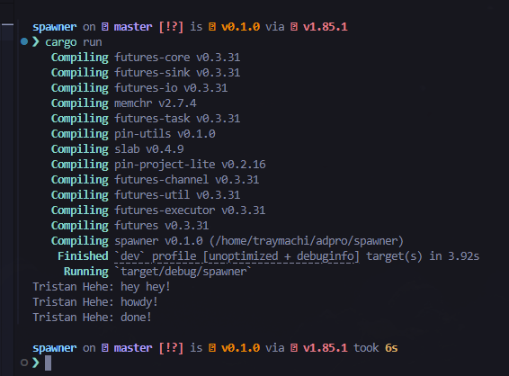

# Spawner Tutorial Module 10 Adpro - Tutorial 1

Tristan Agra Yudhistira (2306245112)

## 1.2 Understanding How it Works



When we run the program, we observe the following output sequence:

```
Tristan Hehe: hey hey!
Tristan Hehe: howdy!
Tristan Hehe: done!
```

This sequence occurs because:

1. The main thread executes the `println!("Tristan Hehe: hey hey!")` statement immediately after spawning the async task
2. The async task is scheduled but not immediately executed - it's queued for later execution
3. The executor then runs the async task, which:
   - First prints "howdy!"
   - Waits for 2 seconds using the TimerFuture
   - Finally prints "done!"

This demonstrates the non-blocking nature of async/await in Rust. The main thread continues execution without waiting for the async task to complete, which is why "hey hey!" appears first. The async task runs concurrently, managed by our custom executor.
