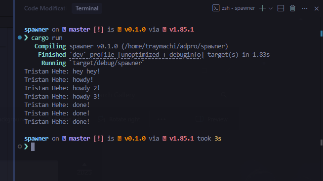
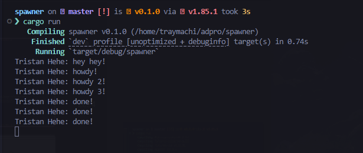

# Spawner Tutorial Module 10 Adpro - Tutorial 1

Tristan Agra Yudhistira (2306245112)

## 1.2 Understanding How it Works


When we run the program, we observe the following output sequence:

```
Tristan Hehe: hey hey!
Tristan Hehe: howdy!
Tristan Hehe: done!
```

This sequence occurs because:

1. The main thread executes the `println!("Tristan Hehe: hey hey!")` statement immediately after spawning the async task
2. The async task is scheduled but not immediately executed - it's queued for later execution
3. The executor then runs the async task, which:
   - First prints "howdy!"
   - Waits for 2 seconds using the TimerFuture
   - Finally prints "done!"

This demonstrates the non-blocking nature of async/await in Rust. The main thread continues execution without waiting for the async task to complete, which is why "hey hey!" appears first. The async task runs concurrently, managed by our custom executor.

## 1.3. Multiple Spawn and Removing Drop

#### Before Dropping



When we run the program with multiple spawns but without dropping the spawner, we observe:

- All tasks are executed in the order they were spawned
- The program completes normally
- Each task runs to completion

#### After Dropping



When we remove the `drop(spawner)` line:

- The executor continues to run indefinitely
- It keeps waiting for new tasks that might be spawned
- The program never exits naturally (requires manual interruption with Ctrl+C)

This behavior demonstrates that:

1. The spawner and executor work together in a producer-consumer pattern
2. The drop is essential for proper program termination
3. Without dropping the spawner, the executor has no way to know when to stop waiting for new tasks

The correlation between these components shows how Rust's async runtime is built:

- Spawner creates tasks (producer)
- Executor runs tasks (consumer)
- Drop provides the termination signal
- Together they form a complete async execution system
